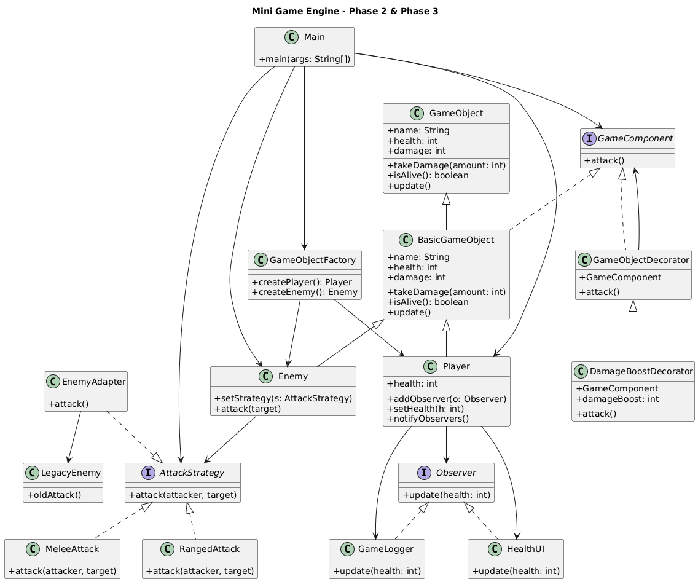

# Game Engine Refactoring Project

## Proje Açıklaması
Bu proje, nesne yönelimli programlama (OOP) prensipleri ve tasarım desenleri kullanılarak geliştirilmiş basit bir oyun motoru mimarisidir. Amaç, sistemi daha esnek, genişletilebilir ve bakımı kolay hale getirmektir.

Proje üç fazdan oluşmaktadır:
- Phase 1: Creational Patterns
- Phase 2: Structural Patterns
- Phase 3: Behavioral Patterns

---

## Kullanılan Tasarım Örüntüleri

### Phase 2 - Structural Patterns

- **Decorator Pattern**
  - GameObject nesnelerine runtime sırasında yeni özellikler eklemek için kullanıldı.
  - Örnek: DamageBoostDecorator

- **Adapter Pattern**
  - LegacyEnemy sınıfını mevcut sistemle uyumlu hale getirmek için kullanıldı.
  - Eski kod değiştirilmeden sisteme entegre edildi.

---

### Phase 3 - Behavioral Patterns

- **Observer Pattern**
  - Player sınıfındaki değişiklikler (örneğin health değişimi) otomatik olarak HealthUI ve GameLogger sınıflarına bildirilir.
  - Event-driven yapı sağlar.

- **Strategy Pattern**
  - Enemy saldırı davranışı runtime’da değiştirilebilir.
  - MeleeAttack ve RangedAttack gibi farklı saldırı stratejileri uygulanmıştır.

---

### OCP (Open/Closed Principle)
Sistem, mevcut kodu değiştirmeden yeni davranışlar eklenebilecek şekilde tasarlanmıştır. Yeni observer veya yeni attack strategy eklemek mevcut yapıyı bozmadan mümkündür.

---

## Mimari Diyagram

## Nasıl Çalıştırılır

### 1. Projeyi bilgisayarına indir

> git clone https://github.com/Senanur-Bal/game-engine-refactoring-project.git

### 2. Proje klasörüne gir

>cd game-engine-refactoring-project

### 3. Kaynak kodu derle

>javac src/*.java

### 4. Programı çalıştır

>java src.Main